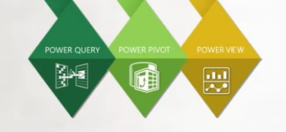
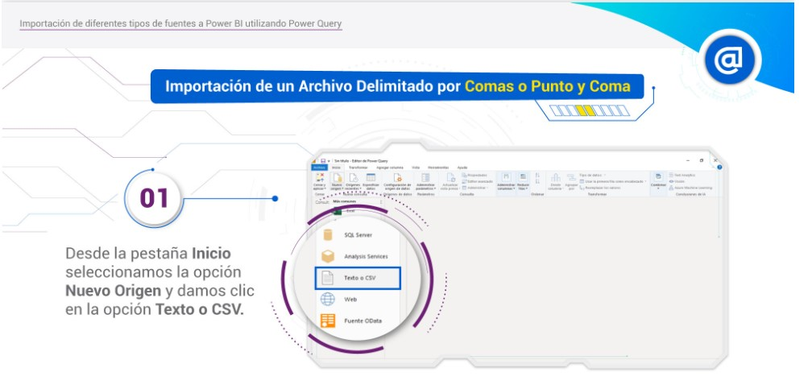
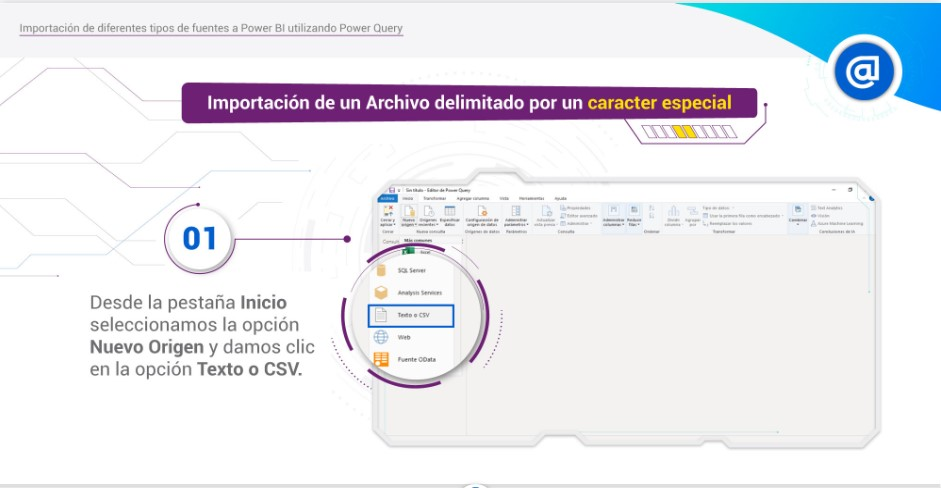

#

# **Introducción** [**Mooc**](https://www.techtarget.com/whatis/definition/massively-open-online-course-MOOC).

### **¿Qué es Power Bi?**

 > Video sobre ¿Qué es Power Bi?
 >>Link [Youtube](https://www.youtube.com/watch?v=3UEI5ovGx4E).

 

 Microsoft Power BI es una herramienta cada vez más popular para crear visualizaciones interactivas en los informes de desempeño organizacional, gracias en parte a su versión gratuita, Power BI Desktop. También proporciona elementos clave para conectarse a varias fuentes de datos tales como `Google Analytic`, `Base de datos DB2 (usadas en servidores transaccionales de grandes volúmenes)`. Ademas generar transformaciones y crear visualizaciones interactivas que respalden la toma de decisiones efectiva.
 Permite la interacción de fuentes  de `Python` y `R` dos de los lenguaes líderes en despliegues de modelos matemáticos y predictivos a nivel mundial.

 Microsoft Power BI se ha convertido en una de las herramientas más populares para crear visualizaciones interactivas en informes de desempeño organizacional desde su lanzamiento en 2015. Power BI continúa expandiendo su alcance gracias a su versión gratuita, Power BI Desktop, que proporciona acceso a la mayoría de las funcionalidades necesarias para diseñar y publicar cuadros de mando organizativos fácilmente. Además, el MOOC proporciona los elementos clave necesarios para conectarse a varias fuentes de datos y generar transformaciones en esos datos para adquirir la información requerida para respaldar una toma de decisiones efectiva.
 # **Inteligencia de negocios “¿Qué es?”**
 Antes de empezar a definir este concepto, te has preguntado ¿Qué hago con la información recopilada en mi base de datos? Pues bien, aquí entra en juego la inteligencia de negocios (Business Intelligence), lo cual es un término general que cubre los procesos y métodos de recopilación, almacenamiento y análisis de los datos con el propósito de optimizar el rendimiento de los mismos.

 Los elementos anteriormente mencionados, se juntan para crear un factor estratégico que brinde soporte a la toma de decisiones de la empresa.

 A continuación, ilustraremos la metodología integral que se debe seguir para obtener, organizar, analizar y finalmente brindar una conclusión de la información analizada.

 

 De acuerdo con la imagen anterior, fijate que se requiere primero obtener los datos para contar con toda la información necesaria, luego se organiza de tal manera que facilite el análisis, después viene como tal la parte de analizar la información obtenida y luego se proporcionan los resultados del análisis.

 ### **¿Por qué es importante la inteligencia de negocios?**

 La inteligencia de negocios es importante para todas las organizaciones, puesto que a través de esta se puede analizar la información y entender de manera apropiada la preferencia de los clientes y los stackholders, otorgando ventaja en el liderazgo del mercado y superioridad frente a la competencia.
 
 A continuación, presentaremos algunas de estas contribuciones: identificar las maneras de aumentar las ganancias, las tendencias del mercado, los problemas del negocio, analizar el comportamiento de los clientes, comparar datos con la competencia, monitorear el rendimiento de las empresas, optimizar las operaciones de las empresas y predecir el éxito de las empresas a corto, mediano y largo plazo.

 Las anteriores son solo algunas de las ocasiones en las que la inteligencia de negocios puede ayudar a las empresas en la toma de decisiones. Ahora, veamos las áreas comunes de la empresa en las que se aplican las soluciones BI:

 .png "")

 ### **Contexto de Power Bi y como descargarlo**
  > Video sobre Cómo instalar Power BI Desktop
  >>Link [Youtube](https://youtu.be/Ri7GiZL6vtQ).

   En esta sección, aprendemos sobre el contexto de Power BI y cómo descargarlo y usarlo. Power BI fue creado por Microsoft para integrar diferentes tecnologías, como  `Power Query y Power Pivot` que estaban disponibles en `Excel`, dentro de una plataforma que podría tomar datos de fuentes originales, realizar diversas transformaciones y cálculos, y finalmente presentar la información en gráficos dinámicos y visualmente atractivos. Asi es que nace Power BI Desktop en 2015, se puede [*descargar gratis*](https://onx.la/4e5e5) y solo está disponible en Windows. Una vez instalado, ofrece características como conectarse a varias fuentes de datos, crear modelos para diferentes relaciones, generar informes personalizables y publicar esos informes dentro de un entorno corporativo seguro o para que cualquiera pueda acceder a ellos en la web. Con diferentes tipos de visualizaciones, Power BI se puede usar para generar varios informes que ayudan a las empresas a comprender mejor sus datos.

# Módulo 1: Conectando y transformando insumos en información
 > Video sobre Elementos de Power BI
 >>Link [Youtube](https://youtu.be/W6AQrpC_Q1Y ).

 **Propósito del Módulo:** Precisar el componente Power Query en la realización de conexiones efectivas a diferentes orígenes de datos.

 Durante este módulo del MOOC, desarrollaremos tres saberes asociados a la importación, transformación y generación de datos a través de Power Query en Power BI.

 En el primer saber, por medio del REDA, revisaremos cómo podemos conectar distintos orígenes de datos como archivos de Excel, archivos delimitados por comas, archivos delimitados por un caracter e incluso, datos provenientes de una página Web. Estos son solo algunos de los muchos orígenes disponibles que se pueden acceder por medio de Power Query desde Power BI, lo que lo convierte en un componente muy versátil para conectarse a las distintas fuentes que necesitemos para nuestros reportes.

 Durante el segundo saber, exploraremos algunas de las funcionalidades para delimitar la información relevante, eliminando columnas,  filas y reemplazando valores según se requiera, a su vez,  filtrando los datos relevantes y transformando el tipo de los datos de las columnas.

 Finalmente, en el tercer saber, estudiaremos cómo podemos anexar información y combinar diferentes consultas así como la generación de columnas basadas en operaciones, transformaciones o cálculos desde columnas existentes. Estos conocimientos nos ayudarán a ajustar los datos según nuestras necesidades. También, conoceremos dos consejos adicionales para consolidar información similar así como rellenar y transformar datos con orientaciones diversas.

 Con estos tres saberes, el estudiante contará con la información fundamental y necesaria para abordar los diversos retos en la conexión, transformación y generación de datos por medio de Power Query desde Power BI, mejorando sus competencias laborales para el mundo real.

 En este primer módulo aprenderemos a manejar Power Query desde Power BI para conectar diversos tipos de fuentes y transformar diferentes datos.

 ### **Saber 1:** 
 Conexiones a diferentes orígenes de datos por medio de Power Query.

 > *Analiza muy bien las palabras y definiciones:*

 * *`RUTA:`* Es la ubicación de las fuentes en diversos formatos, desde archivos almacenados en dispositivos locales de un computador hasta recursos disponibles en páginas Web.
 
 * *`CAMPOS:`* son las columnas o títulos de las diferentes fuentes de datos que permiten identificar el tipo de los valores que contiene nuestra información.

 * *`TIPO DE DATOS:`* Son los diferentes formatos de información que podemos encontrar dependiendo de la columna que estemos analizando. Algunos de estos son, por ejemplo, tipo número, tipo texto o tipo fecha.

 * *`SEPARADOR:`* Es el caracter que permite dividir los diferentes campos que pueda tener una fuente de datos. Los separadores más usados son las comas y los puntos y coma; también se pueden utilizar otros como la barra vertical o “pipe”.
 
 ### **Importación de diferentes tipos de datos**
 > Interfaz de usuario de Power Query
 >>Link 1 [Microsoft](https://learn.microsoft.com/es-es/power-query/power-query-ui).
 
 > **Video sobre cómo importar datos de Excel a Power BI**
 >>Link 1 [Youtube](https://youtu.be/uHC7OHd0O1Y).

 >>Link 2 [Youtube](https://youtu.be/jhsHCZZXoz4).

 > **Cómo importar datos de un archivo delimintado por *`Comas o Punto y Coma`***
 
 > Los demás pasos en el siguiente pdf
 >>Link [PDF](https://github.com/shurming01/Inteligencia-de-negocios-con-Power-Bi/blob/main/ImportaciónDatosComaoPuntoyComa.pdf ).

 > **Cómo importar datos de un archivo delimintado por un *`Caracter especial` y `Página web`***
 
  > Los demás pasos en el siguiente pdf
 >>Link [PDF](https://github.com/shurming01/Inteligencia-de-negocios-con-Power-Bi/blob/main/ImportaciónDatosCarcteresEspecialesyweb.pdf).

 ### **Saber 2: Transformaciones sobre los datos recuperados por medio de Power Query**

 Para facilitar nuestro aprendizaje, comenzaremos con los elementos de transformación simple, pasando por la limpieza y generación de columnas a partir del tipo de datos, continuando con la realización de columnas personalizadas y finalizando con dos poderosos tips para potenciar la consulta y consolidación de datos.
 > **Video sobre problema propuesto**
 >>Link [Youtube](https://youtu.be/s0zoUcCuZy4).

 > **Video sobre limpieza de datos de problema propuesto**
 >>Link [Youtube](https://youtu.be/s0zoUcCuZy4).

