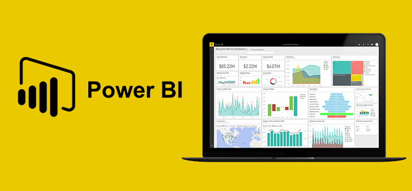

#

# Introducción [Mooc](https://www.techtarget.com/whatis/definition/massively-open-online-course-MOOC).

 Microsoft Power BI es una herramienta cada vez más popular para crear visualizaciones interactivas en los informes de desempeño organizacional, gracias en parte a su versión gratuita, Power BI Desktop. También proporciona elementos clave para conectarse a varias fuentes de datos tales como `Google Analytic`, `Base de datos DB2 (usadas en servidores transaccionales de grandes volúmenes)`. Ademas generar transformaciones y crear visualizaciones interactivas que respalden la toma de decisiones efectiva.
 Permite la interacción de fuentes  de `Python` y `R` dos de los lenguaes líderes en despliegues de modelos matemáticos y predictivos a nivel mundial.

 Microsoft Power BI se ha convertido en una de las herramientas más populares para crear visualizaciones interactivas en informes de desempeño organizacional desde su lanzamiento en 2015. Power BI continúa expandiendo su alcance gracias a su versión gratuita, Power BI Desktop, que proporciona acceso a la mayoría de las funcionalidades necesarias para diseñar y publicar cuadros de mando organizativos fácilmente. Además, el MOOC proporciona los elementos clave necesarios para conectarse a varias fuentes de datos y generar transformaciones en esos datos para adquirir la información requerida para respaldar una toma de decisiones efectiva.
